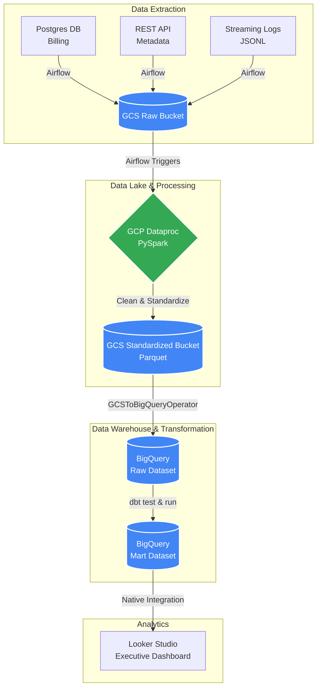

# GCP Streaming Media Data Pipeline

An enterprise-grade, end-to-end Data Engineering pipeline orchestrating the extraction, transformation, and loading (ELT) of streaming media platform data into a Google Cloud BigQuery Data Warehouse.

---

# 🏗️ Architecture



---

# 🛠️ Tech Stack

| Category | Technology |
|---|---|
| Orchestration | Apache Airflow (Docker Containerized) |
| Cloud Platform | Google Cloud Platform (GCP) |
| Data Lake Storage | Google Cloud Storage (GCS) |
| Distributed Processing | GCP Dataproc (Ephemeral PySpark Clusters) |
| Data Warehouse | Google BigQuery |
| Data Modeling & CI/CD | dbt (Data Build Tool), Pytest |
| Business Intelligence | Looker Studio |

---

# 🚀 Pipeline Phases

## 1. Extraction (Landing Zone)

Airflow `PythonOperators` simulate parallel data extraction from:

- PostgreSQL billing database
- TMDB-style REST API
- High-volume streaming watch logs

The extracted data is streamed directly into a GCS **Raw Bucket**.

---

## 2. Standardization (Ephemeral Compute)

Airflow dynamically provisions a Google Cloud Dataproc cluster using custom IAM service account impersonation.

A PySpark job:

- Cleans raw JSON/JSONL data
- Standardizes schemas
- Converts data into compressed Parquet format

The transformed data is written into a GCS **Standardized Bucket**.

After processing completes, Airflow automatically tears down the Dataproc cluster to optimize compute costs.

---

## 3. Data Warehousing (ELT)

Airflow’s `GCSToBigQueryOperator` performs schema-on-read loading of Parquet files into the:

```text
streaming_raw
```

BigQuery dataset.

---

## 4. Data Modeling (Star Schema)

dbt connects to BigQuery and executes SQL-based transformations:

### Staging Models
- Data cleaning
- Data type casting
- Null handling
- Standardization

### Mart Models
- Fact and dimension modeling
- Business-level transformations
- KPI aggregation

Final production-ready table:

```text
fct_user_engagement
```

Stored inside the:

```text
streaming_mart
```

dataset.

---

## 5. Data Quality & Integrity (CI/CD)

### dbt Tests
- NULL checks
- Uniqueness checks
- Relationship tests
- Singular SQL tests for invalid negative values

### Pytest Validation
- Airflow DAG import validation
- DAG dependency integrity
- Cyclic dependency detection

### GitHub Actions
Automated CI/CD pipeline validates:
- Python code quality
- DAG integrity
- dbt project structure

---

## 6. Analytics

The verified Data Mart connects to a Looker Studio dashboard containing:

- KPI scorecards
- Content performance leaderboards
- User engagement analytics
- Streaming behavior trends

---

# 📂 Project Structure

```text
gcp_media_pipeline/
│
├── dags/                           # Airflow DAG definitions
│   ├── gcp_extraction_dag.py
│   ├── gcp_dataproc_dag.py
│   └── gcp_load_bigquery_dag.py
│
├── dbt_project/                    # dbt SQL transformations
│   ├── models/
│   │   ├── staging/                # Data casting and cleanup
│   │   └── marts/                  # Final Star Schema (Fact/Dim tables)
│   ├── tests/                      # Custom singular SQL tests
│   ├── dbt_project.yml
│   └── profiles.yml
│
├── spark_scripts/                  # PySpark processing logic
│   └── process_media_data.py
│
├── tests/                          # CI/CD Python tests
│   └── test_dag_integrity.py
│
├── .github/workflows/              # GitHub Actions CI/CD configuration
│   └── ci-pipeline.yml
│
├── Dockerfile                      # Custom Airflow image with dbt & GCP SDK
├── docker-compose.yaml             # Local infrastructure definition
└── .gitignore                      # Security and cache exclusions
```

---

# ⚙️ Setup Instructions

## 1. Clone the Repository

```bash
git clone https://github.com/your-username/gcp_media_pipeline.git
cd gcp_media_pipeline
```

---

## 2. Configure GCP IAM

Create a Service Account with the following roles:

- Storage Admin
- BigQuery Admin
- Dataproc Administrator
- Service Account User
- Dataproc Worker

Download the JSON service account key and place it inside:

```text
secrets/
```

---

## 3. Build the Environment

Create a `.env` file:

```env
AIRFLOW_UID=50000
```

Build and start the infrastructure:

```bash
docker compose build
docker compose up -d
```

---

## 4. Execute the Pipeline

Access Airflow:

```text
http://localhost:8080
```

Trigger the DAGs sequentially:

```text
Extract → Dataproc → BigQuery Load
```

---

## 5. Run dbt Transformations

Execute dbt inside the Airflow webserver container:

```bash
docker exec -it gcp_media_pipeline-airflow-webserver-1 \
bash -c "cd /opt/airflow/dbt_project && dbt run && dbt test"
```

---

# ✅ Features

- Fully containerized local development environment
- End-to-end ELT orchestration using Airflow
- Distributed PySpark processing on ephemeral Dataproc clusters
- Cloud-native Data Lake architecture on GCS
- BigQuery Data Warehouse integration
- Production-style dbt modeling workflow
- Automated testing and CI/CD validation
- Business intelligence dashboard integration
- Cost-optimized ephemeral compute strategy

---

# 📊 Example Data Flow

```text
Postgres/API/Logs
        ↓
GCS Raw Bucket
        ↓
Dataproc PySpark Standardization
        ↓
GCS Standardized Parquet
        ↓
BigQuery Raw Dataset
        ↓
dbt Transformations
        ↓
BigQuery Mart Dataset
        ↓
Looker Studio Dashboard
```

---

# 🔐 Security & Best Practices

- Service Account impersonation for secure Dataproc execution
- Secrets excluded using `.gitignore`
- Dockerized isolated environment
- Automated pipeline validation through CI/CD
- Schema enforcement using dbt tests
- Cost-efficient ephemeral cluster provisioning

---

# 📈 Future Enhancements

- Terraform Infrastructure as Code (IaC)
- Real-time streaming with Kafka/PubSub
- Incremental dbt models
- Data lineage with OpenLineage
- Monitoring with Prometheus & Grafana
- Great Expectations for advanced data validation
- CI/CD deployment to Cloud Composer

---